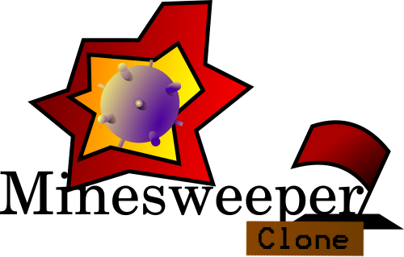
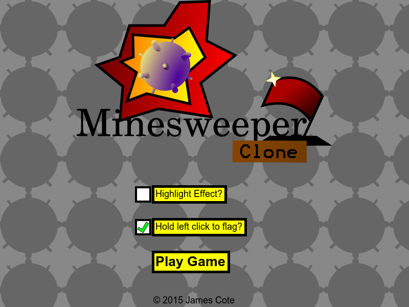
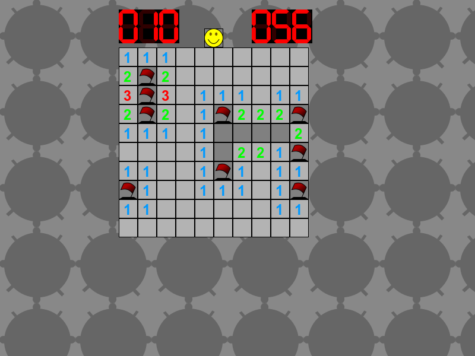

# 
-----------------
Simple clone of the well-known Minesweeper game. Created using Javascript, node.js, and pixi.js.

##  Features 
- Simple and familiar Minesweeper gameplay
- Ability to initialize a Minesweeper instance with specified height and width of board, and amount of mines
- Game rendering with Pixi.js

##  Screenshots 

##  Install 
Browserify is used to patch together all the js files linked via require into a single bundle.js file. To do this, run the following:

*browserify browser_setup.js > bundle.js*

If your browser supports loading images, etc. via the file:// protocol, then just load up index.html. Otherwise, run the server via the following command:

*node server/server.js*

Once the server is running, just go to localhost:9000 and it should be there.

##  Issues 
- Unit and Integration testing is limited
- CLI: Boards of height >= 10 display slightly slanted because those rows have a y-coord number of multiple digits to display
- Stack overflow (RangeError) when recursive revealing boards with dimensions 100x100 or greater

##  Future Additions 
- Microsoft Mode (first click guaranteed not a mine)
- Timed Mode
