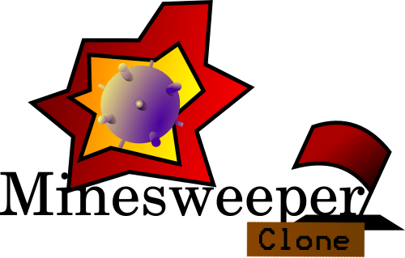

# 

[](https://github.com/Coteh/MinesweeperClone/actions/workflows/run-tests.yml)
[](https://github.com/Coteh/MinesweeperClone/releases/tag/v2.0.0-alpha-1)
[](http://coteh.github.io/MinesweeperClone/)

Simple clone of the well-known Minesweeper game. Created using JavaScript, Node.js, and PixiJS.

## Features
- Simple and familiar Minesweeper gameplay
- Ability to initialize a Minesweeper instance with specified height and width of board, and number of mines
- Game rendering with PixiJS

## Screenshots


## Installation
To run the game locally, follow these steps:

1. **Install Dependencies**

   Run the following command to install the necessary dependencies:
   ```sh
   npm install
   ```

2. **Build the Game**

    Use the following command to build the game:
    ```sh
    npm run build
    ```

3. **Serve the Game Locally**

    Run a local server to serve the contents of the build directory and open the game in your browser:
    ```sh
    npm run serve
    ```

    Then open http://localhost:4173 to play the game locally.

4. **Development Mode**

    To run the game in development mode, use the following command:
    ```sh
    npm run dev
    ```

    Then open http://localhost:5173 to play the game locally in development mode. The game will reload on changes in the source.

## Issues
- Stack overflow (RangeError) when recursive revealing boards with dimensions 100x100 or greater [#3](https://github.com/Coteh/MinesweeperClone/issues/3)

## Future Additions
- Timed Mode
